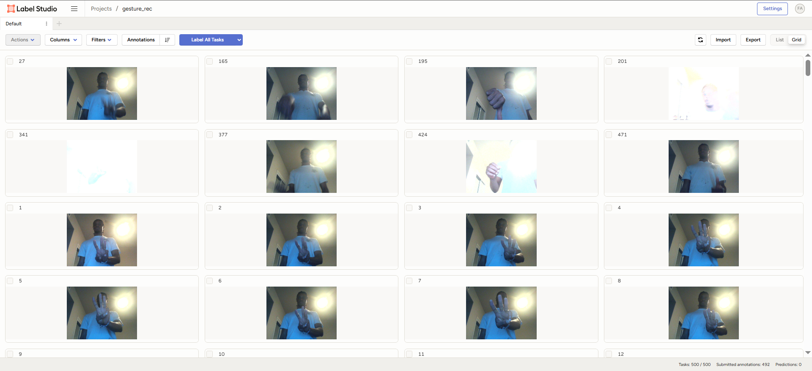
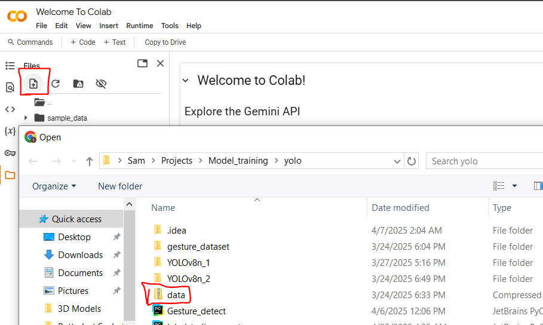

#   YOLO-Transfer-Learning

Leveraging transfer learning to train A YOLOv8n model to predict a custom gesture dataset.

## Description

This project utilized label studio for labeling and the ultralytics library in a google colab to perform the transfer learning.

### Dependencies

* ultralytics
* opencv-python

### Executing program

* Install requirements to your environment.
```
!pip install -r requirements.txt
```
* Run yolo_image_collection.ipynb to collect data modify dataset path, labels and number of images to be collected to suit you needs.
```
import cv2
import os
import time
import uuid

IMAGES_PATH = '<your dataset path>'

labels = ['your_label1','your_label2']
number_imgs = 50

for label in labels:
    os.mkdir(IMAGES_PATH+label)
    cap = cv2.VideoCapture(0)
    print('Collecting images for {}'.format(label))
    time.sleep(5)
    for imgnum in range(number_imgs):
        ret, frame = cap.read()
        imgname = os.path.join(IMAGES_PATH, label, label+'.'+'{}.jpg'.format(str(uuid.uuid1())))
        cv2.imwrite(imgname, frame)
        cv2.imshow('frame', frame)
        time.sleep(2)

        if cv2.waitKey(1) & 0xFF == ord('q'):
            break
    cap.release()
```
* Next [install label studio](https://labelstud.io/guide/install.html#Install-using-pip) and import collected images for labeling.


* After labeling, run labelstudio_export.py. Update label studio url, project ID and api_key with relevant info.
```
from label_studio_sdk import Client

# Set your Label Studio details
LABEL_STUDIO_URL = "http://localhost:8080"  # Change this to your Label Studio instance
API_KEY = "<api_key>"  # Replace with your label-studio API key
PROJECT_ID = 2  # Replace with your actual project ID
EXPORT_TYPE = 'YOLO_WITH_IMAGES'

# Connect to the Label Studio API
ls = Client(url=LABEL_STUDIO_URL, api_key=API_KEY)
ls.check_connection()

# Get the project
project = ls.get_project(PROJECT_ID)

project.export_tasks(
    export_type=EXPORT_TYPE,
    download_resources=True,
    export_location='data.zip'
)
```
* In a [google colab](https://colab.research.google.com/notebooks/intro.ipynb) notebook upload data.zip
  
* Next unzip data and create some directories to hold the images.
```
# Unzip images to a custom data folder
!unzip -q /content/data.zip -d /content/custom_data
```
* Ultralytics requires a particular folder structure to store training data for models. The root folder is named “data”. Inside, there are two main folders:

* Train: These are the actual images used to train the model. In one epoch of training, every image in the train set is passed into the neural network. The training algorithm adjusts the network weights to fit the data in the images.  

*  Validation: These images are used to check the model's performance at the end of each training epoch.  
  
* In each of these folders is a “images” folder and a “labels” folder, which hold the image files and annotation files respectively.
* Use this script from edje electronics to partition train and validation directories
```
!wget -O /content/train_val_split.py https://raw.githubusercontent.com/EdjeElectronics/Train-and-Deploy-YOLO-Models/refs/heads/main/utils/train_val_split.py
!python train_val_split.py --datapath="/content/custom_data" --train_pct=0.9
```
* Install ultralytics to the google colab
```
!pip install ultralytics
```
* Create the Ultralytics training configuration YAML file which specifies the location of train and validation data as well as defines the model's classes
* Ensure you have a labelmap file located at custom_data/classes.txt you can manually create one according to this [format](https://github.com/ultralytics/ultralytics/blob/main/ultralytics/cfg/datasets/coco128.yaml)
```
# Python function to automatically create data.yaml config file
# 1. Reads "classes.txt" file to get list of class names
# 2. Creates data dictionary with correct paths to folders, number of classes, and names of classes
# 3. Writes data in YAML format to data.yaml

import yaml
import os

def create_data_yaml(path_to_classes_txt, path_to_data_yaml):

  # Read class.txt to get class names
  if not os.path.exists(path_to_classes_txt):
    print(f'classes.txt file not found! Please create a classes.txt labelmap and move it to {path_to_classes_txt}')
    return
  with open(path_to_classes_txt, 'r') as f:
    classes = []
    for line in f.readlines():
      if len(line.strip()) == 0: continue
      classes.append(line.strip())
  number_of_classes = len(classes)

  # Create data dictionary
  data = {
      'path': '/content/data',
      'train': 'train/images',
      'val': 'validation/images',
      'nc': number_of_classes,
      'names': classes
  }

  # Write data to YAML file
  with open(path_to_data_yaml, 'w') as f:
    yaml.dump(data, f, sort_keys=False)
  print(f'Created config file at {path_to_data_yaml}')

  return

# Define path to classes.txt and run function
path_to_classes_txt = '/content/custom_data/classes.txt'
path_to_data_yaml = '/content/data.yaml'

create_data_yaml(path_to_classes_txt, path_to_data_yaml)

print('\nFile contents:\n')
!cat /content/data.yaml
```
* Run training
```
!yolo detect train data=/content/data.yaml model=yolo11s.pt epochs=60 imgsz=640
```
* Model testing
```
!yolo detect predict model=runs/detect/train/weights/best.pt source=data/validation/images save=True
```
* Run model on validation folder displaying first 10 results
```
import glob
from IPython.display import Image, display
for image_path in glob.glob(f'/content/runs/detect/predict/*.jpg')[:10]:
  display(Image(filename=image_path, height=400))
  print('\n')
```
* Download model
```
# Create "my_model" folder to store model weights and train results
!mkdir /content/my_model
!cp /content/runs/detect/train/weights/best.pt /content/my_model/my_model.pt
!cp -r /content/runs/detect/train /content/my_model

# Zip into "my_model.zip"
%cd my_model
!zip /content/my_model.zip my_model.pt
!zip -r /content/my_model.zip train
%cd /content
```
```
# you can also just download the model from the sidebar
from google.colab import files

files.download('/content/my_model.zip')
```
* Unzip the model in the same directory as Gesture_detect (YOLOv8n_1) and you'll have a custom trained object detection model.
```
  from ultralytics import YOLO
import cv2
import requests as rq

# Load YOLOv8n model
model = YOLO("YOLOv8n_1/YOLOv8ngestureRec.pt")

# initilize cam
cam = cv2.VideoCapture(0)
if not cam.isOpened():
    print("Camera unavailable")
    exit()
while True:
    ret, frame = cam.read()
    #frame error check
    if not ret:
        print("Frame could not be read")
        continue
    #run inference
    results = model.predict(frame,conf=.5,imgsz= 480, max_det=1)
    #process results list
    for result in results:
        boxes = result.boxes.cls.tolist()
        while boxes:
            label = boxes[0]
            print(label)
    #annotate frame
    bound_frame = results[0].plot()
    #display frame
    cv2.imshow("Bounding Boxes", bound_frame)
    #quit condition
    if cv2.waitKey(1) == ord("q"):
        break

cv2.destroyAllWindows()
cam.release()
```
## Author

Samuel Kalu
  
* email : [samkalu@ttu.edu](mailto:samkalu@ttu.edu)
* linkedin : [@SamuelKalu](https://www.linkedin.com/in/samuel-kalu-74a359342/)


## Acknowledgments

Inspiration, code snippets, etc.
* [Edje Electronics](https://www.ejtech.io/learn/train-yolo-models)
* [Nicholas Renotte](https://www.youtube.com/c/nicholasrenotte)

